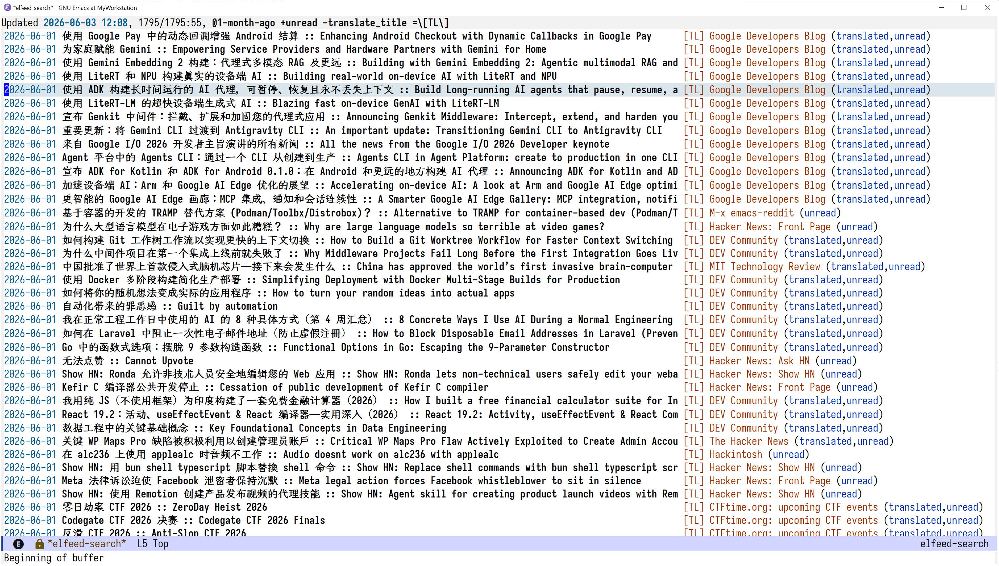

#+TITLE: elfeed-translate
#+AUTHOR: pilrymage
#+LANGUAGE: en

=elfeed-translate= translates Elfeed RSS entry titles and/or content through an
OpenAI-compatible chat-completions API.  It writes separate local RSS 2.0 feeds,
so the source subscriptions and their original entries remain untouched.

Translations are cached in SQLite and new work is sent in batches.  Each batch
uses an id-bearing JSON protocol, so translations are matched to their source by
id rather than by output position or a fragile text delimiter.

* Requirements

- Emacs 29.1 or newer (built-in SQLite support is required)
- Elfeed 3.0 or newer
- An OpenAI-compatible =/chat/completions= endpoint

* Installation

#+begin_src elisp
(use-package elfeed-translate
  :straight (elfeed-translate
             :type git
             :host github
             :repo "Pilrymage/elfeed-translate")
  :custom
  (elfeed-translate-api-key "sk-...")
  (elfeed-translate-target-lang "Chinese")
  :config
  (global-elfeed-translate-mode 1))
#+end_src

Prefer =auth-source= or another secret store over a literal key.  API keys must
be ASCII strings; the package validates and normalizes HTTP headers before a
request is sent.

The repository is a multi-file package.  Straight places the repository on
=load-path=, so =(require 'elfeed-translate)= loads all internal modules; no
additional Straight recipe entries are needed.

* Single Target Language Policy

One running installation is intentionally treated as having one global target
language, configured by =elfeed-translate-target-lang=.  Per-feed languages,
automatic language switching, and language-aware cache keys are outside the
current design.

This keeps collection, caching, RSS generation, and diagnostics simple.  If the
configured target language is changed deliberately, clear the cache with
=M-x elfeed-translate-clear-cache= before translating again.  Changing target
language dynamically without clearing the cache is unsupported.

* Quick Start

Tag feeds independently for title and content translation:

#+begin_src elisp
(setq elfeed-feeds
      '(("https://example.com/en/rss" translate_title translate_content blog)
        ("https://example.com/titles-only.xml" translate_title)))
#+end_src

The equivalent =elfeed-org= tags are =:translate_title:= and
=:translate_content:=.

1. Enable =global-elfeed-translate-mode= and open Elfeed.
2. Run =M-x elfeed-translate-show-feeds= and copy the generated =file:///= feeds
   into =elfeed-feeds= or the elfeed-org file.
3. Run =M-x elfeed-update=.  Translation starts after all source feeds finish.
4. Run =M-x elfeed-update= again to fetch the generated local feeds, or enable
   =elfeed-translate-auto-refresh=.

* Important Configuration

| Variable | Default | Purpose |
|----------+---------+---------|
| =elfeed-translate-api-key= | =""= | Provider credential |
| =elfeed-translate-api-url= | OpenAI chat completions | API endpoint |
| =elfeed-translate-model= | =gpt-4o-mini= | Provider model id |
| =elfeed-translate-target-lang= | =Chinese= | Single global target language |
| =elfeed-translate-feed-tag= | =translate_title= | Title translation autotag |
| =elfeed-translate-content-tag= | =translate_content= | Content translation autotag |
| =elfeed-translate-batch-size= | =30= | Titles per request |
| =elfeed-translate-content-batch-size= | =5= | Content snippets per request |
| =elfeed-translate-content-max-chars= | =500= | Source characters per snippet |
| =elfeed-translate-output-dir= | =<elfeed-db-directory>/translated= | Generated RSS directory |
| =elfeed-translate-cache-file= | =~/.emacs.d/var/elfeed-translate/translate-cache.sqlite= | Shared persistent translation cache |
| =elfeed-translate-parallel= | =nil= | Enable concurrent batches |
| =elfeed-translate-max-concurrent= | =4= | Parallel request limit |
| =elfeed-translate-request-timeout= | =60= | Per-request timeout in seconds |
| =elfeed-translate-max-retries= | =3= | Retries for translation-result failures |
| =elfeed-translate-retry-base-delay= | =1.0= | Initial retry delay |
| =elfeed-translate-retry-max-delay= | =30.0= | Maximum retry delay |
| =elfeed-translate-max-consecutive-fatal= | =3= | Parallel circuit-breaker threshold |
| =elfeed-translate-max-throttle-wait= | =30= | Max 429 =Retry-After= honored (seconds) |
| =elfeed-translate-auto-refresh= | =nil= | Fetch local feeds after translation |
| =elfeed-translate-debug= | =nil= | Detailed credential-safe diagnostics |

All options are available through =M-x customize-group RET elfeed-translate=.

* Batch JSON Protocol

The user message is ordinary text containing a JSON array:

#+begin_src json
[
  {"id":"item-0001","text":"First title"},
  {"id":"item-0002","text":"A title containing --- and a \"quote\""}
]
#+end_src

The model is asked to return only:

#+begin_src json
[
  {"id":"item-0002","translation":"第二个标题"},
  {"id":"item-0001","translation":"第一个标题"}
]
#+end_src

Order does not matter.  The parser requires every expected id exactly once and
rejects missing, duplicate, or unknown ids.  JSON escaping protects quotes,
newlines, backslashes, HTML, and literal =---= text.  Markdown-fenced JSON is
accepted defensively.  The old =---= and line-based response formats remain as
compatibility fallbacks for models that ignore the JSON instruction.

* Retry Policy

Retries are deliberately limited to cases where the provider answered normally
but did not produce a complete usable translation.  Transport failures fail
fast so a broken network, proxy, or rate limit does not keep the translation
cycle occupied.

| Failure | Retry? | Reason |
|---------+--------+--------|
| DNS, proxy, TLS, connection error, timeout | No | External transport state is unlikely to improve inside this cycle |
| Any HTTP error, including 400, 429 and 5xx | No | Preserve the provider error and return control quickly |
| Missing OpenAI =choices/message/content= structure | No | Usually an incompatible endpoint or model |
| HTTP 2xx with malformed response JSON | Yes | Provider completed the request but returned unusable data |
| =finish_reason= =length= or =max_tokens= | Yes | Completion was truncated |
| =finish_reason= =content_filter= or =safety= | No | Repeating the same blocked input is not useful |
| Other non-=stop= finish reasons | Yes | The model did not complete the requested translation |
| Invalid translation JSON or missing/duplicate/unknown ids | Yes | The model failed the batch protocol |
| Translation count mismatch in the legacy fallback | Yes | The batch cannot be paired safely |

Retryable failures use exponential backoff with jitter.  Both serial and
parallel dispatchers hold the cycle-level busy lock while waiting, preventing a
second translation cycle from starting over the same uncached entries.

** Parallel failure handling

Parallel mode replaces the serial fail-fast behavior with a circuit breaker
and a 429 throttle, so scattered transient errors do not abort an otherwise
healthy translation cycle:

- Transport failures (=network=, =timeout=, =send=) self-heal once: the batch
  is re-queued after a short backoff.  Each such failure increments a
  consecutive-fatal counter; when it reaches =elfeed-translate-max-consecutive-fatal=
  (default 3) the cycle aborts, discarding pending batches and draining
  in-flight requests.
- HTTP 429 pauses new dispatch until the provider's =Retry-After= (clamped to
  =elfeed-translate-max-throttle-wait=, default 30 s) expires, then resumes from
  the queue.  After two throttled retries a still-rate-limited batch escalates
  to a fatal failure.
- Other failures (configuration, non-429 HTTP, parse errors, ...) abort the
  cycle immediately, as in serial mode.

Network, proxy, DNS, timeout and provider HTTP failures abort the complete
cycle.  No further queued batches are sent; already in-flight parallel requests
are allowed to finish, then successfully returned translations are cached and
RSS finalization still runs once.

* Commands

| Command | Purpose |
|---------+---------|
| =elfeed-translate-show-feeds= | Show generated local feed URLs |
| =elfeed-translate-update= | Start a translation cycle manually |
| =elfeed-translate-test-api= | Translate two test titles through the complete pipeline |
| =elfeed-translate-clear-cache= | Delete cached translations |
| =elfeed-translate-stats= | Show feed and cache statistics |
| =elfeed-translate-setup= | Initialize cache, RSS files, and hooks |
| =elfeed-translate-teardown= | Remove update hooks and close SQLite |
| =global-elfeed-translate-mode= | Arrange setup when Elfeed opens |

The test command displays request encoding checks, HTTP status,
=finish_reason=, selected output protocol, and translated text.  The API key is
always redacted.

* Cache and Local Feeds

The cache path is configured independently by
=elfeed-translate-cache-file=.  Its default is
=~/.emacs.d/var/elfeed-translate/translate-cache.sqlite= (relative to the actual
=user-emacs-directory=).  Generated XML remains under
=elfeed-translate-output-dir=.  Changing or maintaining several RSS output
directories therefore does not fork translation history.

The cache key is the MD5 of the source text and its value is the raw
translation.  Writes are committed per successful batch, so completed work
survives later batch failures or an Emacs crash.  On the first 0.7 load, SQLite
databases found in the active output directory, the Elfeed DB output directory,
and the historical =~/.elfeed/translated= location are merged into the fixed
cache.  Preferred/newer sources are imported first; duplicate keys are not
overwritten, and old database files are retained as recovery copies.

Do not put the cache in Straight's =straight/build= directory.  Straight may
replace that directory during a package rebuild.

Each source feed maps to a stable =MD5(feed-url).xml= file.  Generated entry
GUIDs combine the feed hash with the original entry id to avoid collisions.
Title display formatting is applied only during RSS generation, so changing
=elfeed-translate-title-style= or =elfeed-translate-title-separator= does not
invalidate cached translations.

If the output directory changes while old =file:///= translated subscriptions
remain in =elfeed-feeds=, setup displays a warning.  Run
=M-x elfeed-translate-show-feeds= and replace those URLs; otherwise Elfeed keeps
reading XML files from the old directory even though translation succeeded.

Generated RSS is always written as UTF-8 with Unix line endings, including on
Windows where the default file coding system may otherwise be a locale code
page.

* Source Modules

The public entry point remains =elfeed-translate.el=.  It loads five internal
modules from the same repository:

| File | Responsibility |
|------+----------------|
| =elfeed-translate-core.el= | Customization and shared result values |
| =elfeed-translate-cache.el= | Fixed SQLite persistence, legacy DB merge and cache-key ownership |
| =elfeed-translate-api.el= | Request encoding, HTTP and response parsing |
| =elfeed-translate-elfeed.el= | Elfeed DB access, feed paths and RSS rendering |
| =elfeed-translate-engine.el= | Collection, serial/parallel dispatch, circuit breaker, 429 throttle and update hooks |
| =elfeed-translate.el= | Public commands, setup and global minor mode |

The API returns source-text/translation pairs and has no knowledge of SQLite.
The cache module alone converts source text to MD5 keys.  Likewise, the API
performs one HTTP request without reading the translation-cycle busy state;
serial and parallel coordination belongs to the engine module.

* Tests

Offline ERT suites live under =test/=, with one test module per source module.
For a standard Straight checkout:

#+begin_src shell
emacs --batch -Q -L . -L test \
  -L ~/.emacs.d/straight/build/elfeed \
  -l test/run-tests.el
#+end_src

The tests do not contact a translation provider.  They cover UTF-8 request and
RSS encoding, id-based pairing, =finish_reason= classification, SQLite cache
transactions, Elfeed RSS generation, module loading and batch collection.

* Debugging

Set =elfeed-translate-debug= to non-nil and first run
=M-x elfeed-translate-test-api=.  Diagnostics include:

- endpoint, model, batch size, and JSON byte encoding;
- HTTP and transport status without the Authorization value;
- response JSON keys and =finish_reason=;
- id-JSON versus legacy parser selection;
- retry classification and delay;
- failed raw responses in =*elfeed-translate-debug*=.

* License

GPL-3.0-or-later.
